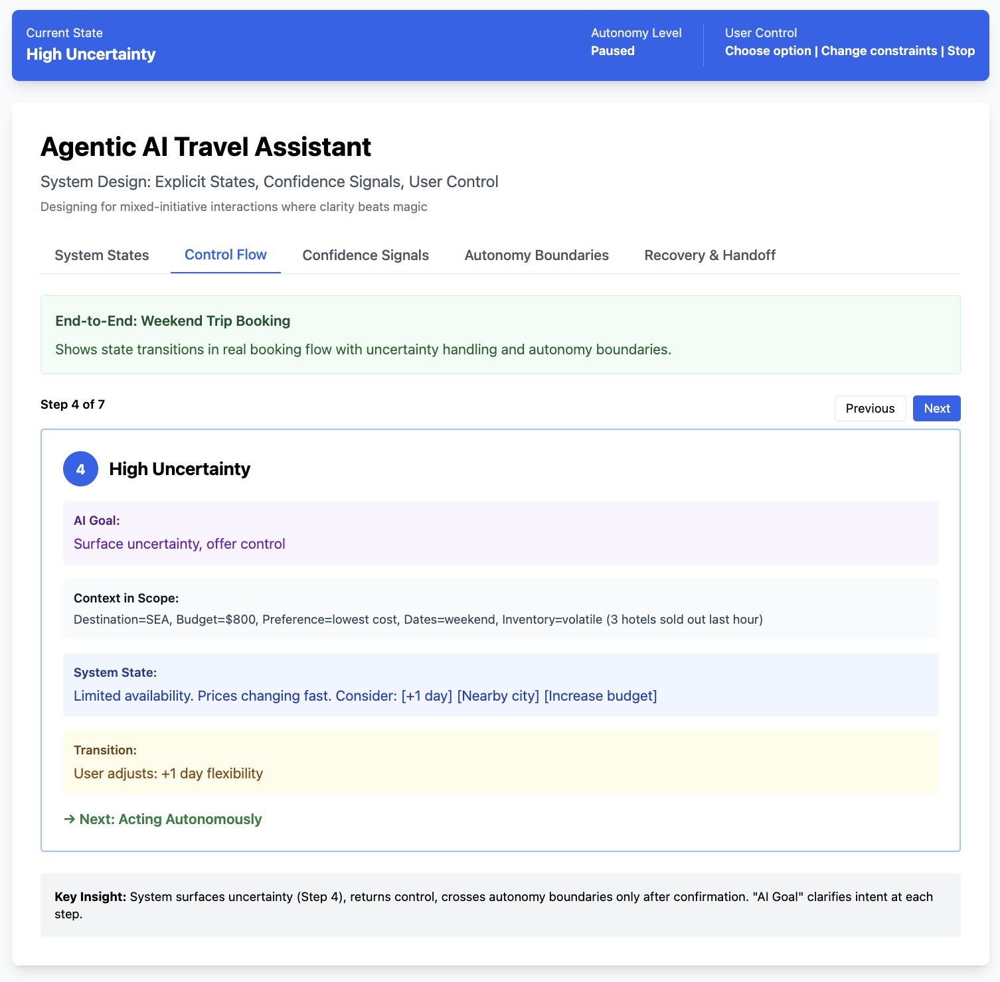

# Agentic AI Travel Assistant — UX Systems Prototype

**Live interactive prototype:**  
https://ashleysally00.github.io/ai-travel-ux-systems-prototype/

---

## Overview

This is a **working UX systems prototype** that explores how agentic AI can support travel planning and booking **without sacrificing clarity, trust, or user control**.

Rather than focusing on visual polish, this project models:
- Explicit system states
- Confidence-based autonomy
- Clear user control at every step
- Graceful recovery and human handoff

The prototype is intentionally transparent: users can always see **what the system is doing, why it is doing it, and what they can change**.

---

## Design Problem

AI-driven travel experiences introduce real risk:
- Money is involved
- Inventory is volatile
- Preferences are often ambiguous
- Errors are costly (financially and emotionally)

Many AI interfaces feel “magical” but leave users uncertain:
- *Is it still working?*
- *Did it assume something incorrectly?*
- *Can I stop this before it books something?*

For example: an AI might optimize for **“cheapest option”** when the user actually wanted comfort, leading to a long layover booking the user never wanted.

This project explores a different approach:  
**state-aware UX where clarity beats magic and control is always visible.**

---

## Core UX Principles

- **Explicit State Awareness**  
  The system always exposes its current state (Listening, Acting, Uncertainty, Confirmation, etc.).

- **Confidence Signals, Not Scores**  
  Autonomy decisions are driven by interpretable signals (clarity, volatility, risk), not opaque percentages.

- **Autonomy Boundaries**  
  Low-risk actions happen automatically. High-stakes actions pause and require explicit confirmation.

- **User Control Is Always Visible**  
  Stop, undo, change constraints, or hand off to a human at any point.

- **Graceful Failure**  
  When assumptions break, the system explains *why* and offers recovery paths instead of silently failing.

---

## State-Based System Design

This prototype uses **state-machine thinking** to model AI behavior.  
Each system state has explicit entry conditions, exit criteria, allowed actions, and transitions, so the AI behaves predictably within defined boundaries and does not feel opaque to the user.

---

## What This Prototype Demonstrates

### 1. Explicit System States
Seven modeled states with clear entry and exit conditions:
- Listening / Understanding  
- Clarifying Intent  
- Acting Autonomously  
- High Uncertainty  
- Awaiting Confirmation  
- Transacting  
- Recovery & Handoff  

Each state defines:
- What the AI is allowed to do
- What the user can control
- How transitions occur

---

### 2. End-to-End Control Flow
A complete weekend-trip booking scenario shows:
- How ambiguity triggers clarification
- How inventory volatility pauses automation
- How autonomy resumes once constraints are resolved
- Where confirmation gates appear before payment

---

### 3. Autonomy Contract
Clear separation between:
- **Safe autonomous actions** (searching, filtering, drafting itineraries)
- **Actions requiring confirmation** (booking, cancellations, payments)
- **Actions requiring human agents** (policy exceptions, disputes, accessibility needs)

---

### 4. Recovery & Human Handoff
When the system detects a mismatch or error:
- Automation pauses
- Assumptions are stated explicitly
- User regains control
- Context is preserved for fast human handoff (no re-explaining)

---

## Screenshots

### System States with Entry & Exit Conditions

  

*Click any state to inspect entry conditions, exit criteria, transitions, user control, and example system messages.*

---

### Control Flow: Uncertainty Handling

  

*Step 4 demonstrates how the system detects inventory volatility and pauses automation instead of making assumptions.*

---

### Recovery & Human Handoff

  

*Graceful failure pattern showing transparent reasoning, control restoration, and fast human agent handoff with preserved context.*

---

## Why This Matters

From a UX and business perspective, this approach:
- Reduces accidental bookings and cancellations
- Increases user trust in AI-assisted flows
- Improves conversion by preventing anxiety-driven abandonment
- Lowers support costs through clearer recovery paths

---

## How to Use the Prototype

1. Open the live prototype
2. Use the tabs to explore:
   - **System States**
   - **Control Flow**
   - **Confidence Signals**
   - **Autonomy Boundaries**
   - **Recovery & Handoff**
3. Step through the booking flow to see how state transitions and control surfaces change

---

## Scope & Intent

This is a **UX systems and interaction design artifact** demonstrating Principal-level thinking about agentic AI patterns. It is a design prototype, not a production integration.

- No real bookings are made
- No external APIs are used
- The focus is on interaction logic, states, and trust mechanisms

---

## Tech Stack
- Pure HTML, CSS, and JavaScript (no build required)
- Tailwind CSS via CDN
- No frameworks, no dependencies

---

## Author Notes

This prototype was created to explore **principal-level AI experience design** —  
how to design agentic systems that are powerful *and* legible to users, especially in high-stakes domains like travel.
